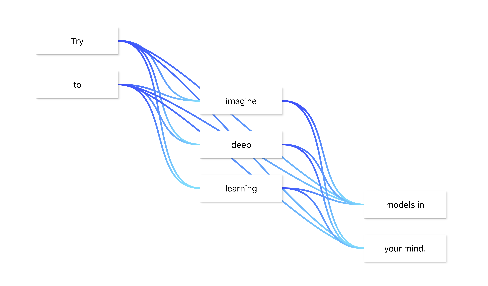
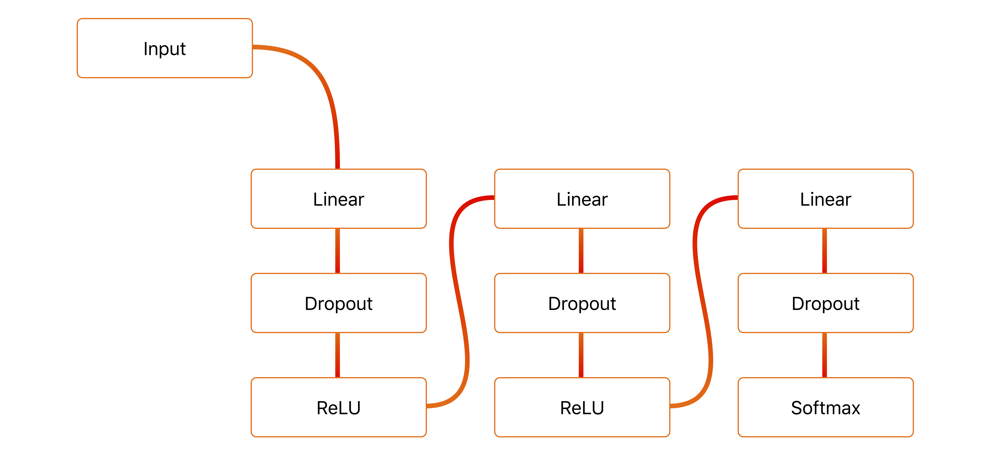

# Flowpoints

Create deep learning models without all the typing and dimension mismatches! Follow [this link](https://mariusbrataas.github.io/flowpoints_ml) to play around with this on your own :)

[This npm package](https://www.npmjs.com/package/flowpoints) is a spin-off of this project, which this project is now utilizing.

Here's a [colab](https://colab.research.google.com/drive/15zC7TMheMzwllEShgN45Y7JLXtS-syMn) using this PyTorch [model.](https://mariusbrataas.github.io/flowpoints_ml/?p=9fehu18ra4ty)


And here's similar [colab](https://colab.research.google.com/drive/1rkJItfTb8fB0mWQRmL-shsiReFLJ57vR) using this TensorFlow [model](https://mariusbrataas.github.io/flowpoints_ml/?p=KlHpdLzP3SDx)


## Overview
This project is used to host a website in which users can quickly create drafts for deep learning models and have the equivalent plug-and-play code output immediately.

The code output to the user is written in python and utilizes [PyTorch](https://pytorch.org/) and [TensorFlow](https://www.tensorflow.org/alpha).

- [Overview](#overview)
- [User guide](#user-guide)
	- [How I use these diagrams](#how-i-use-these-diagrams)
	- [Building new models](#building-new-models)
		- [Adding flowpoints](#adding-flowpoints)
		- [Adding and removing connections](#adding-and-removing-connections)
		- [Changing the parameters of your model](#changing-the-parameters-of-your-model)
	- [Changing appearance](#changing-appearance)
	- [Extracting the model code](#extracting-the-model-code)
	- [Sharing your model](#sharing-your-model)
- [Example output](#example-output)
- [Contributing to this project](#contributing-to-this-project)
- [Dependencies](#dependencies)
- [License](#license)

## User guide

Or maybe just play around with it yourself?

### How I use these diagrams
1. Start by adding an input block and edit it's parameters to get the correct number of dimensions and features.
2. Add a bunch of blocks, organize them a little bit and add all connections.
3. Start from the top and move downstream, editing block parameters to ensure their outputs match the desired dimensions.
4. Add names to all blocks (if needed).
5. Quickly review code.
6. Copy code, plug it into existing pipeline, lean back, and watch the magic.


### Building new models

#### Adding flowpoints
In the lower left corner of the [website](https://mariusbrataas.github.io/flowpoints_ml/) there are five buttons. These can be used to add new flowpoints (blocks) to the model, copy code to clipboard, generate a link to the current model, hide/show sidebar, and display a dialog to help users get started.

To build a new model start by clicking the blue + button. This will add a Flowpoint.

Click the + button a few more times to add more points. These will automatically connect if you don't click anywhere else on the screen.


#### Adding and removing connections
To connect one Flowpoint to another, start by clicking on the first point. Then hold shift while clicking the second point. The points should now be connected. To disconnect the two simply repeat this process.

#### Changing the parameters of your model
Each flowpoint represents one operation in your model. To edit a Flowpoint's function and parameters, click the "Flowpoint"-tab in the sidebar (if the sidebar is not showing click the menu-button in the bottom left of your screen).

The top field in the sidebar allow you to change the operation of the selected flowpoint. Simply click it to display a list of all available operations.

In the second field you can enter a name for your flowpoint. If you don't type a name your flowpoint will be named p_1, p_2, p_3, etc.. in the output python code.

In the parameters area all the available parameters of the flowpoint can be viewed, and most of them can be changed. The "in_features" field will automatically be set to a valid size.


### Changing appearance
In the "Settings"-tab you can change the appearance of your diagrams. Theme and variant changes the look of your flowpoints, while the switches change the background and what information your flowpoints should display.


### Extracting the model code
If you click the "Code"-tab you'll see all the code for your model. The easiest way to copy this code to your clipboard is by clicking the "copy"-button, just beneath the + button.


### Sharing your model
To share your model, simply click the "link"-button. This will generate a link which will get copied to your clipboard.

## Example output
The following code was generated for [this model.](https://mariusbrataas.github.io/flowpoints_ml/?p=LHhe4I81I1a3)




In TensorFlow:

```python
'''
Created using flowpoints.io

Link to model:
https://mariusbrataas.github.io/flowpoints_ml/?p=LHhe4I81I1a3

LICENSE:
https://github.com/mariusbrataas/flowpoints_ml/blob/master/LICENSE
'''


# Importing TensorFlow tools
import tensorflow as tf


# Model
def NeuralNet(optimizer='adam', loss='sparse_categorical_crossentropy', metrics=['accuracy']):

    # Initializing inputs
    in_data = tf.keras.layers.Input((1,10,), name='in_data')

    # Initializing layers
    fc1 = tf.keras.layers.Dense(
        name               = "fc1",
        units              = 96,
        use_bias           = True,
        kernel_initializer = "glorot_uniform",
        bias_initializer   = "zeros",
    )(in_data)
    do1 = tf.keras.layers.Dropout(
        name = "do1",
        rate = 1,
    )(fc1)
    act1 = tf.keras.layers.ReLU(
        name           = "act1",
        negative_slope = 0,
        threshold      = 0,
    )(do1)
    fc2 = tf.keras.layers.Dense(
        name               = "fc2",
        units              = 96,
        use_bias           = True,
        kernel_initializer = "glorot_uniform",
        bias_initializer   = "zeros",
    )(act1)
    do2 = tf.keras.layers.Dropout(
        name = "do2",
        rate = 1,
    )(fc2)
    act2 = tf.keras.layers.ReLU(
        name           = "act2",
        negative_slope = 0,
        threshold      = 0,
    )(do2)
    fc3 = tf.keras.layers.Dense(
        name               = "fc3",
        units              = 5,
        use_bias           = True,
        kernel_initializer = "glorot_uniform",
        bias_initializer   = "zeros",
    )(act2)
    do3 = tf.keras.layers.Dropout(
        name = "do3",
        rate = 1,
    )(fc3)

COULD NOT ADD act3 (Sigmoid)!
The layertype is not available in the the currently selected librar.


    # Creating model
    _model = tf.keras.models.Model(
        inputs  = [in_data],
        outputs = [act3],
        name    = 'flowpoints.io/?p=LHhe4I81I1a3'
    )

    # Compiling model
    _model.compile(
        optimizer = optimizer,
        loss      = loss,
        metrics   = metrics
    )

    # Returning model
    return _model
```


Or similarly, in PyTorch:

```python
'''
Created using flowpoints.io

Link to model:
https://mariusbrataas.github.io/flowpoints_ml/?p=LHhe4I81I1a3

LICENSE:
https://github.com/mariusbrataas/flowpoints_ml/blob/master/LICENSE
'''


# Importing PyTorch tools
import torch
from torch import nn, optim, cuda


# Importing other libraries
import numpy as np
import matplotlib.pyplot as plt
import time


# Model
class NeuralNet(nn.Module):


    def __init__(self, optimizer=optim.SGD, alpha=0.01, criterion=nn.CrossEntropyLoss(), use_cuda=None):

        # Basics
        super(NeuralNet, self).__init__()

        # Settings
        self.optim_type = optimizer
        self.optimizer  = None
        self.alpha      = alpha
        self.criterion  = criterion

        # Use CUDA?
        self.use_cuda = use_cuda if (use_cuda != None and cuda.is_available()) else cuda.is_available()

        # Current loss and loss history
        self.train_loss      = 0
        self.valid_loss      = 0
        self.train_loss_hist = []
        self.valid_loss_hist = []

        # Initializing all layers
        self.fc1 = nn.Linear(
            in_features  = 10,
            out_features = 96,
            bias         = False,
        )
        self.do1 = nn.Dropout(
            p       = 0.25,
            inplace = False,
        )
        self.act1 = nn.ReLU(
            inplace = False,
        )
        self.fc2 = nn.Linear(
            in_features  = 96,
            out_features = 96,
            bias         = False,
        )
        self.do2 = nn.Dropout(
            p       = 0.25,
            inplace = False,
        )
        self.act2 = nn.ReLU(
            inplace = False,
        )
        self.fc3 = nn.Linear(
            in_features  = 96,
            out_features = 5,
            bias         = False,
        )
        self.do3 = nn.Dropout(
            p       = 0.25,
            inplace = False,
        )
        self.act3 = nn.Sigmoid()

        # Running startup routines
        self.startup_routines()


    def startup_routines(self):
        self.optimizer = self.optim_type(self.parameters(), lr=self.alpha)
        if self.use_cuda:
            self.cuda()


    def predict(self, in_data):

        # Switching off autograd
        with torch.no_grad():

            # Use CUDA?
            if self.use_cuda:
                in_data = in_data.cuda()

            # Running inference
            return self.forward(in_data)


    def forward(self, in_data):
        in_data = self.fc1(in_data)     # Linear
        in_data = self.do1(in_data)     # Dropout
        in_data = self.act1(in_data)    # ReLU
        in_data = self.fc2(in_data)     # Linear
        in_data = self.do2(in_data)     # Dropout
        in_data = self.act2(in_data)    # ReLU
        in_data = self.fc3(in_data)     # Linear
        in_data = self.do3(in_data)     # Dropout
        self.state = self.act3(in_data) # Sigmoid
        return self.state


    def fit_step(self, training_loader):

        # Preparations for fit step
        self.train_loss = 0 # Resetting training loss
        self.train()        # Switching to autograd

        # Looping through data
        for in_data, act3_target in training_loader:

            # Use CUDA?
            if self.use_cuda:
                in_data = in_data.cuda()
                act3_target = act3_target.cuda()

            # Forward pass
            self.forward(in_data)

            # Calculating loss
            loss = self.criterion(self.state, act3_target)
            self.train_loss += loss.item() # Adding to epoch loss

            # Backward pass and optimization
            loss.backward()                      # Backward pass
            self.optimizer.step()                # Optimizing weights
            self.optimizer.zero_grad()           # Clearing gradients

        # Adding loss to history
        self.train_loss_hist.append(self.train_loss / len(training_loader))


    def validation_step(self, validation_loader):

        # Preparations for validation step
        self.valid_loss = 0 # Resetting validation loss

        # Switching off autograd
        with torch.no_grad():

            # Looping through data
            for in_data, act3_target in validation_loader:

                # Use CUDA?
                if self.use_cuda:
                    in_data = in_data.cuda()
                    act3_target = act3_target.cuda()

                # Forward pass
                self.forward(in_data)

                # Calculating loss
                loss = self.criterion(self.state, act3_target)
                self.valid_loss += loss.item() # Adding to epoch loss

            # Adding loss to history
            self.valid_loss_hist.append(self.valid_loss / len(validation_loader))


    def fit(self, training_loader, validation_loader=None, epochs=10, show_progress=True, save_best=False):

        # Helpers
        best_validation = 1e5

        # Possibly prepping progress message
        if show_progress:
            epoch_l = max(len(str(epochs)), 2)
            print('Training model...')
            print('%sEpoch   Training loss   Validation loss   Duration   Time remaining' % ''.rjust(2 * epoch_l - 4, ' '))
            t = time.time()

        # Looping through epochs
        for epoch in range(epochs):
            self.fit_step(training_loader) # Optimizing
            if validation_loader != None:  # Perform validation?
                self.validation_step(validation_loader) # Calculating validation loss

            # Possibly printing progress
            if show_progress:
                eta_s = (time.time() - t) * (epochs - epoch)
                eta = '%sm %ss' % (round(eta_s / 60), 60 - round(eta_s % 60))
                print('%s/%s' % (str(epoch + 1).rjust(epoch_l, ' '), str(epochs).ljust(epoch_l, ' ')),
                    '| %s' % str(round(self.train_loss_hist[-1], 8)).ljust(13, ' '),
                    '| %s' % str(round(self.valid_loss_hist[-1], 8)).ljust(15, ' '),
                    '| %ss' % str(round(time.time() - t, 3)).rjust(7, ' '),
                    '| %s' % eta.ljust(14, ' '))
                t = time.time()

            # Possibly saving model
            if save_best:
                if self.valid_loss_hist[-1] < best_validation:
                    self.save('best_validation')
                    best_validation = self.valid_loss_hist[-1]

        # Switching to eval
        self.eval()


    def plot_hist(self):

        # Adding plots
        plt.plot(self.train_loss_hist, color='blue', label='Training loss')
        plt.plot(self.valid_loss_hist, color='springgreen', label='Validation loss')

        # Axis labels
        plt.xlabel('Epoch')
        plt.ylabel('Loss')
        plt.legend(loc='upper right')

        # Displaying plot
        plt.show()


    def save(self, name='model.pth'):
        if not '.pth' in name: name += '.pth'
        torch.save({
            'fc1': self.fc1,
            'do1': self.do1,
            'act1': self.act1,
            'fc2': self.fc2,
            'do2': self.do2,
            'act2': self.act2,
            'fc3': self.fc3,
            'do3': self.do3,
            'act3': self.act3,
            'train_loss':      self.train_loss,
            'valid_loss':      self.valid_loss,
            'train_loss_hist': self.train_loss_hist,
            'valid_loss_hist': self.valid_loss_hist,
            'optim_type':      self.optim_type,
            'alpha':           self.alpha,
            'criterion':       self.criterion,
            'use_cuda':        self.use_cuda
        }, name)


    @staticmethod
    def load(name='model.pth'):
        if not '.pth' in name: name += '.pth'
        checkpoint = torch.load(name)
        model = NeuralNet(
            optimizer = checkpoint['optim_type'],
            alpha     = checkpoint['alpha'],
            criterion = checkpoint['criterion'],
            use_cuda  = checkpoint['use_cuda']
        )
        model.fc1 = checkpoint['fc1']
        model.do1 = checkpoint['do1']
        model.act1 = checkpoint['act1']
        model.fc2 = checkpoint['fc2']
        model.do2 = checkpoint['do2']
        model.act2 = checkpoint['act2']
        model.fc3 = checkpoint['fc3']
        model.do3 = checkpoint['do3']
        model.act3 = checkpoint['act3']
        model.train_loss      = checkpoint['train_loss']
        model.valid_loss      = checkpoint['valid_loss']
        model.train_loss_hist = checkpoint['train_loss_hist']
        model.valid_loss_hist = checkpoint['valid_loss_hist']
        model.startup_routines()
        return model
```

## Contributing to this project
I'd love some help maintaining this project or adding more and better functionality!

The code is maintained in the master branch, while the website is hosted from the gh-pages branch.

As of right now the code is not properly commented, but I'll do that pretty soon.

Some ideas I'd like to implement:

- __Pre-processing.__ Maybe something utilizing the [torch data loader](https://pytorch.org/docs/stable/data.html#torch.utils.data.DataLoader), with support for multiple workers and use of [transforms](https://pytorch.org/docs/stable/torchvision/transforms.html).
- __Better support for mobile.__ Not so great on my phone, kinda ok on my iPad.
- __Python load model by link??__ Maybe not possible, but would be awesome!

Also, this project is structured in a somewhat okay manner, but I'm not entirely happy with it, and might change it soon.

```
flowpoints_ml
├── .gitattributes
├── .gitignore
├── LICENSE
├── package-lock.json
├── package.json
├── README.md
│
├── public
│   ├── favicon.ico
│   ├── index.html
│   └── manifest.json
│
└── src
    ├── App.css
    ├── App.js
    ├── Cryptographer.js
    ├── DataBaseHandler.js
    ├── HelpDialog.js
    ├── Helpers.js
    ├── index.css
    ├── index.js
    ├── LibraryParser.js
    ├── MainButtons.js
    ├── MainLibrary.js
    ├── NotificationContainer.js
    ├── PasswordDialog.js
    ├── serviceWorker.js
    │
    ├── libraries
    │   ├── base_library.js
    │   ├── pytorch_autoparams.js
    │   ├── pytorch_library.js
    │   └── tensorflow_library.js
    │
    ├── parser
    │   ├── FlowOrder.js
    │   ├── Parser.js
    │   ├── PyTorchParser.js
    │   └── TensorflowParser.js
    │
    └── sidebar
        ├── CodeTab.js
        ├── FlowpointTab.js
        ├── FrontHelpers.css
        ├── FrontHelpers.js
        ├── MiscTab.js
        ├── Sidebar.css
        ├── Sidebar.js
        ├── SidebarContents.css
        ├── SidebarContents.js
        └── SidebarHead.js
```


## Dependencies
Current dependencies in this project are:

- [Flowpoints](https://github.com/mariusbrataas/flowpoints)
- [Material UI](https://material-ui.com/)
- [React JS](https://reactjs.org/)
- [react-copy-to-clipboard](https://github.com/nkbt/react-copy-to-clipboard)
- [Axios](https://github.com/axios/axios)
- [react-icons](https://github.com/react-icons/react-icons)
- [react-syntax-highlighter](https://github.com/conorhastings/react-syntax-highlighter)


## License
[MIT](https://github.com/mariusbrataas/flowpoints_ml/blob/master/LICENSE)